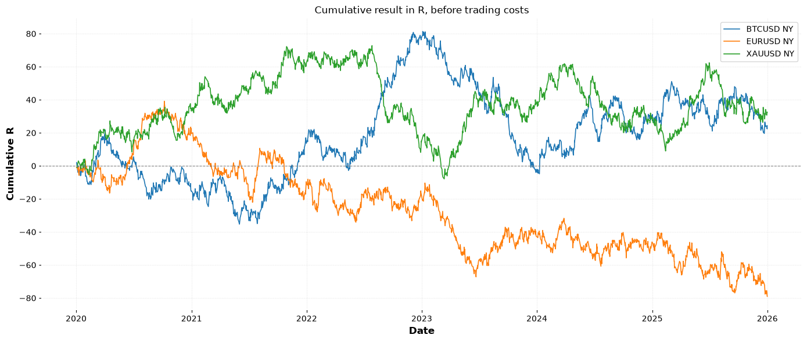
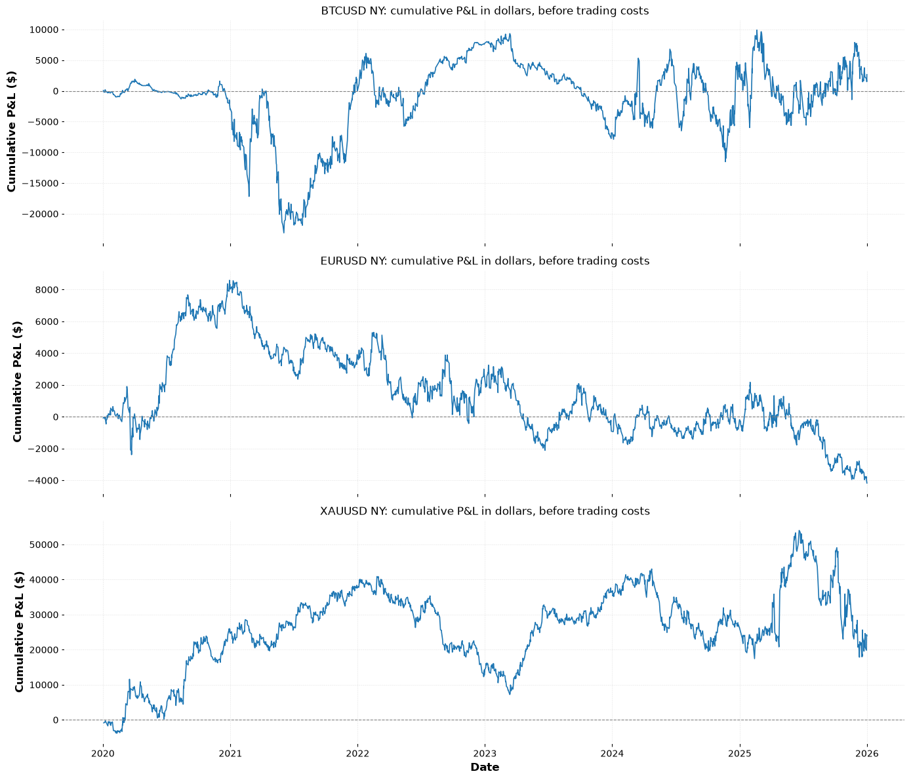

# First 4H Candle Breakout and Re-entry

### A strattest research study

We took a popular YouTube scalping strategy, turned it into exact rules, and tested it on six years of 5-minute data across EURUSD, gold and Bitcoin. Traded as presented, the strategy shows no edge, but resuts are worth a closer look.

## The strategy

This strategy was found by searching YouTube for "profitable forex strategy."

**Source:** [YouTube video](https://www.youtube.com/watch?v=O5eC5lY7ZXY)

The rules, as presented:

1. Mark the high and low of the first 4-hour candle of the day, using New York time.
2. On the 5-minute chart, wait for a candle to close outside that range. Wicks don't count.
3. Wait for a candle to close back inside the range.
4. A break above followed by a close back inside is a short. A break below followed by a close back inside is a long.
5. Place the stop at the extreme of the breakout move and target twice the risk (2R).
6. Take as many trades as the day offers.

## What we found

| Market | Trades | Win rate | Average R per trade | Total R | Max drawdown |
|---|---|---|---|---|---|
| Bitcoin | 3,148 | 37.8% | +0.008 | +24.4R | 86.2R |
| EURUSD | 3,109 | 36.8% | −0.025 | −79.0R | 118.2R |
| Gold | 3,139 | 37.7% | +0.010 | +32.3R | 80.7R |

- **The strategy trades often.** About 2 trades per day, and roughly 9 days in 10 produce at least one setup.
- **Before trading costs, it breaks even.** Across more than 9,000 trades, the average result per trade is close to zero on all three markets.
- **The results swing a lot.** Drawdowns reached 80 to 118R, and single years ranged from +63.7R to −79.4R. A short test can make this strategy look very good or very bad, depending on when it is run.
- **All three markets behave almost the same.** About 55% of trades hit the stop, 25% reach the target, and 20% are closed at the end of the day.



All results are in R, where 1R is the amount risked on a trade, and are shown before trading costs.

## In dollars

With the same position size on every trade (100,000 euros on EURUSD, 100 ounces of gold, 1 Bitcoin), the totals before costs were **+$2,661 on Bitcoin, −$4,171 on EURUSD and +$23,963 on gold**.

These figures depend heavily on a small number of trades with very wide stops, and on how far prices moved over the period, so they should not be read as an edge. Trading costs can also effect the prices



## How it was tested

- **Markets:** EURUSD, XAUUSD (gold), BTCUSD (Bitcoin)
- **Period:** 1 January 2020 to 31 December 2025
- **Data:** 5-minute candles from MetaTrader 5, converted to New York time
- **Weekends:** excluded for all markets

Where the video was unclear, we made each rule precise before running the full test. The main decisions:

- The reference candle is 00:00 to 04:00 New York time. Setups run until midnight, when any open trade is closed. Fridays end at 17:00.
- Trades enter at the open of the candle after the re-entry.
- On very large breakouts, the creator moves the stop to a nearby level by eye. We made this a fixed rule: if the stop distance is more than 2 times the range height, the stop moves to the nearest swing point confirmed before entry.
- If one candle touches both the stop and the target, the trade counts as a loss.
- One trade is open at a time.

The full rulebook and a decision log, with the reason behind every choice, are in Section 2 of the notebook.

## Repository contents

```
├── notebooks/
│   └── research.ipynb    # the full research, from data to results
├── data/
│   ├── raw/                 # 5-minute data for each market
│   └── cooked/              # daily tables, trade logs and skipped setups
├── plots/                   # equity curves
└── report/
    └── first-4h-candle-reentry_results.xlsx   # summary, yearly and monthly results, every trade, rules and assumptions
```

## How to reproduce

1. Install the requirements:
```
   pip install -r requirements.txt
```
2. Open `notebooks/01_research.ipynb`.
3. The prepared data is already in `data/raw`, so you can start from Section 2. Fetching fresh data in Section 1 needs the MetaTrader 5 terminal, which runs on Windows, and a broker account. Broker symbol names and server times vary, so check both before fetching.
4. Run Sections 2 to 4 once for each market, changing `symbol` in the Section 2 settings each time.
5. Run Section 5 to produce the results, charts and Excel report.

## About strattest

Every trader has rules, but most of them live in their head or on a chart. strattest takes your strategy, works through it with you until every rule is clear and testable, and then tests it against years of historical data.

You get to see how your strategy actually behaves: how often it trades, how often it wins, how deep the drawdowns go, and whether the results hold up across markets and over time. Every decision we make along the way is written down, so you know exactly what was tested.

This study is an example of that process.

**Want your strategy tested?** Visit [strattest.app](https://strattest.app).

---

*This research is for educational purposes only and is not financial advice. Past results do not guarantee future performance.*
